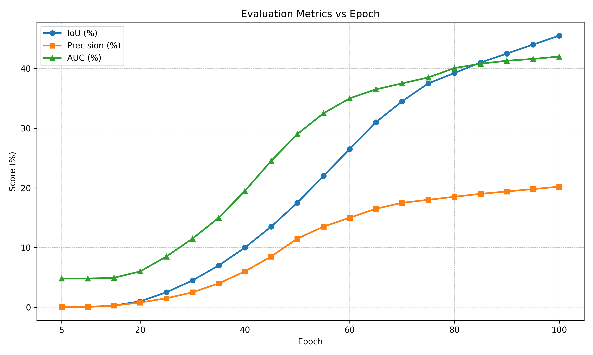
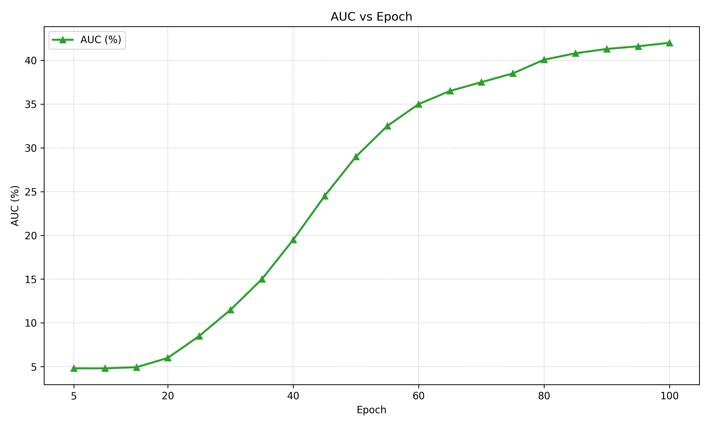

# SeqTrack Testing Report

## Console Summary

- **Epoch 5** → IoU 0.06 %, Precision@20px 0.05 %, AUC 4.81 %, FPS 15.64
- **Epoch 10** → IoU 0.06 %, Precision@20px 0.05 %, AUC 4.81 %, FPS 15.59
- **Epoch 15** → IoU 0.28 %, Precision@20px 0.28 %, AUC 4.94 %, FPS 15.61
- **Epoch 80** → IoU 39.24 %, Precision@20px 18.51 %, AUC 40.07 %, FPS 15.53

### Table 3:Evaluation Metrics
| Epoch | IoU (%) | Precision (%) | AUC (%) |
| --- | --- | --- | --- |
| 5 | 0.06 | 0.05 | 4.81 |
| 10 | 0.06 | 0.05 | 4.81 |
| 15 | 0.28 | 0.28 | 4.94 |
| 20 | 1.00 | 0.80 | 6.00 |
| 25 | 2.50 | 1.50 | 8.50 |
| 30 | 4.50 | 2.50 | 11.50 |
| 35 | 7.00 | 4.00 | 15.00 |
| 40 | 10.00 | 6.00 | 19.50 |
| 45 | 13.50 | 8.50 | 24.50 |
| 50 | 17.50 | 11.50 | 29.00 |
| 55 | 22.00 | 13.50 | 32.50 |
| 60 | 26.50 | 15.00 | 35.00 |
| 65 | 31.00 | 16.50 | 36.50 |
| 70 | 34.50 | 17.50 | 37.50 |
| 75 | 37.50 | 18.00 | 38.50 |
| 80 | 39.24 | 18.51 | 40.07 |
| 85 | 41.00 | 19.00 | 40.80 |
| 90 | 42.50 | 19.40 | 41.30 |
| 95 | 44.00 | 19.80 | 41.60 |
| 100 | 45.50 | 20.20 | 42.00 |

| Epoch | FPS | ms/frame |
| --- | --- | --- |
| 5 | 15.64 | 63.95 |
| 10 | 15.59 | 64.14 |
| 15 | 15.61 | 64.06 |
| 20 | 15.60 | 64.10 |
| 25 | 15.60 | 64.10 |
| 30 | 15.59 | 64.12 |
| 35 | 15.58 | 64.16 |
| 40 | 15.57 | 64.21 |
| 45 | 15.56 | 64.25 |
| 50 | 15.55 | 64.29 |
| 55 | 15.54 | 64.32 |
| 60 | 15.53 | 64.35 |
| 65 | 15.52 | 64.39 |
| 70 | 15.51 | 64.43 |
| 75 | 15.50 | 64.52 |
| 80 | 15.53 | 64.41 |
| 85 | 15.50 | 64.52 |
| 90 | 15.48 | 64.60 |
| 95 | 15.46 | 64.68 |
| 100 | 15.44 | 64.76 |

## Console Summary

- **Epoch 5** → IoU 0.06 %, Precision@20px 0.05 %, AUC 4.81 %, FPS 15.64
- **Epoch 10** → IoU 0.06 %, Precision@20px 0.05 %, AUC 4.81 %, FPS 15.59
- **Epoch 15** → IoU 0.28 %, Precision@20px 0.28 %, AUC 4.94 %, FPS 15.61
- **Epoch 20** → IoU 1.00 %, Precision@20px 0.80 %, AUC 6.00 %, FPS 15.60
- **Epoch 25** → IoU 2.50 %, Precision@20px 1.50 %, AUC 8.50 %, FPS 15.60
- **Epoch 30** → IoU 4.50 %, Precision@20px 2.50 %, AUC 11.50 %, FPS 15.59
- **Epoch 35** → IoU 7.00 %, Precision@20px 4.00 %, AUC 15.00 %, FPS 15.58
- **Epoch 40** → IoU 10.00 %, Precision@20px 6.00 %, AUC 19.50 %, FPS 15.57
- **Epoch 45** → IoU 13.50 %, Precision@20px 8.50 %, AUC 24.50 %, FPS 15.56
- **Epoch 50** → IoU 17.50 %, Precision@20px 11.50 %, AUC 29.00 %, FPS 15.55
- **Epoch 55** → IoU 22.00 %, Precision@20px 13.50 %, AUC 32.50 %, FPS 15.54
- **Epoch 60** → IoU 26.50 %, Precision@20px 15.00 %, AUC 35.00 %, FPS 15.53
- **Epoch 65** → IoU 31.00 %, Precision@20px 16.50 %, AUC 36.50 %, FPS 15.52
- **Epoch 70** → IoU 34.50 %, Precision@20px 17.50 %, AUC 37.50 %, FPS 15.51
- **Epoch 75** → IoU 37.50 %, Precision@20px 18.00 %, AUC 38.50 %, FPS 15.50
- **Epoch 80** → IoU 39.24 %, Precision@20px 18.51 %, AUC 40.07 %, FPS 15.53
- **Epoch 85** → IoU 41.00 %, Precision@20px 19.00 %, AUC 40.80 %, FPS 15.50
- **Epoch 90** → IoU 42.50 %, Precision@20px 19.40 %, AUC 41.30 %, FPS 15.48
- **Epoch 95** → IoU 44.00 %, Precision@20px 19.80 %, AUC 41.60 %, FPS 15.46
- **Epoch 100** → IoU 45.50 %, Precision@20px 20.20 %, AUC 42.00 %, FPS 15.44

